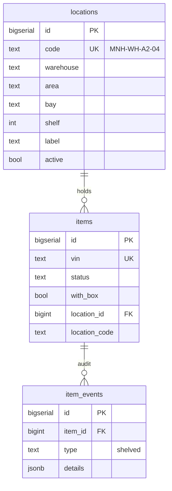
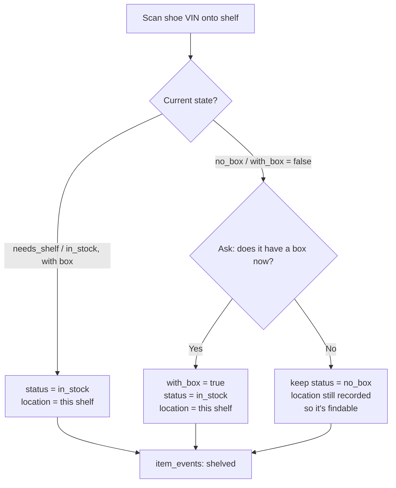
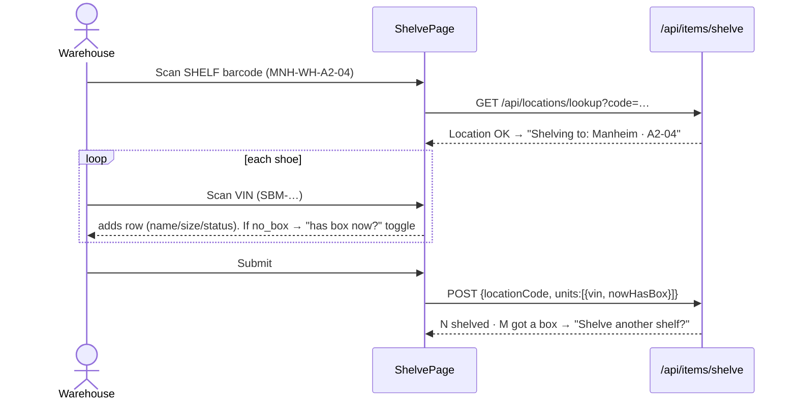

# Shelf Location System — Design & Flow Summary

> **Status: PLAN / FOR REVIEW.** Nothing is built yet. This document is the
> blueprint for the "scan a shelf, put shoes on it, and always be able to find
> them" feature, plus the shelf-label printing system. Review + approve (and
> confirm the **Open Decisions** at the bottom) before we write any code.

---

## 1. What we're building (in one paragraph)

Warehouse staff physically place shoes on shelves. We give every shelf a
**barcode**. Staff open a **Shelve / Put‑away** page, **scan the shelf**, then
**scan every shoe** they're placing there. On submit, each shoe is recorded at
that exact shelf and its status becomes **In Stock** (shown as *In Stock ·
A2‑04*). If a scanned shoe was **bought without a box**, we ask *"Does it have a
box now?"* — Yes flips it to *with box* (sellable). Later, anyone can **search a
shoe (VIN / SKU / name) and instantly see where it lives**, or **open a shelf and
see everything on it**. Staff can **transfer** a box to another shelf by simply
scanning it onto the new shelf. Finally, staff can **print shelf labels** (name +
barcode, fixed ATM‑card size) — pick shelves in bulk and choose the **paper
size** (Letter / A4 / Legal / A5 / 4×6) to print on.

---

## 2. Vocabulary & the Manheim structure

From your two PDFs:

| Term | Meaning | Example |
|---|---|---|
| **Warehouse (Site)** | A physical building/property | Manheim Main Shed, Mount Joy, Kready's Farm |
| **Area** | A zone inside a site | Warehouse Rows, Pods, Office Space, Basement Space |
| **Bay** | A shelving unit / column | `A2`, `K10`, `B6`, `Pod 1` |
| **Shelf** | One physical shelf in a bay, numbered **bottom → up** | `A2` shelf **4** |
| **Location** | Bay + Shelf = the exact spot a shoe sits | `A2-04` |

**⚠️ Collision problem the PDFs reveal:** within Manheim alone, bay **A2** exists
in *Warehouse Rows*, *Office Space*, AND *Basement Space*. So `A2-04` is **not**
globally unique. Barcodes must encode the **site + area** too (see §4).

**Manheim location counts** (what we'd auto‑generate):

| Area | Bays | Locations |
|---|---|---|
| Warehouse Rows (A–K) | 41 bays | **189** |
| Pods | Pod 1–4 (whole‑bay) | **4** |
| Office Space | A1–A3 | **8** |
| Basement Space | A1–A12, B1–B6 | **52** |
| **Total** | | **≈ 253** |

Mount Joy & Kready's Farm have **no data yet** → must be **added manually**
(single add + bulk add), which the design fully supports.

---

## 3. Data model (new + changed)

### New table: `locations`
```
locations (
  id          BIGSERIAL PRIMARY KEY,
  code        TEXT UNIQUE NOT NULL,   -- the BARCODE value, globally unique  → "MNH-WH-A2-04"
  warehouse   TEXT NOT NULL,          -- "Manheim Main Shed" | "Mount Joy" | "Kready's Farm"
  area        TEXT,                   -- "Warehouse Rows" | "Pods" | "Office" | "Basement" | NULL
  bay         TEXT NOT NULL,          -- "A2", "K10", "Pod 1", "B6"
  shelf       INT,                    -- 1..N (bottom→up); NULL for whole-bay spots (pods)
  label       TEXT,                   -- display shown big on the tag → "A2-04" (derived if blank)
  active      BOOLEAN NOT NULL DEFAULT true,
  sort_order  INT,                    -- stable ordering for lists/printing
  created_by  TEXT,
  created_at  TIMESTAMPTZ DEFAULT now(),
  updated_at  TIMESTAMPTZ DEFAULT now()
)
```

### Changed table: `items` (add columns)
```
ALTER TABLE items ADD COLUMN IF NOT EXISTS location_id   BIGINT REFERENCES locations(id);
ALTER TABLE items ADD COLUMN IF NOT EXISTS location_code TEXT;   -- denormalized snapshot for fast search/print
```
- `location_id` = source of truth (FK). `location_code` = a snapshot so
  Inventory/PH rows can show/search location **without a join** and it survives a
  label rename. Both set together at shelve time.
- `item_events` gets a new `type = 'shelved'` (the `type` column is plain TEXT —
  no enum change needed). Details: `{ locationCode, from, gotBox? }`.

### ER diagram


---

## 4. Barcode / code scheme

**Code = the string encoded in the shelf barcode (CODE128, same lib as VIN labels).**

```
   MNH  -  WH  -  A2  -  04
   │       │      │      │
   site    area   bay    shelf(zero-padded)
```

| Site | Prefix |   | Area | Prefix |
|---|---|---|---|---|
| Manheim Main Shed | `MNH` |   | Warehouse Rows | `WH` |
| Mount Joy | `MTJ` |   | Pods | `PD` |
| Kready's Farm | `KRF` |   | Office Space | `OF` |
|  |  |   | Basement Space | `BS` |

Examples: `MNH-WH-A2-04`, `MNH-WH-K10-02`, `MNH-PD-1` (pod, no shelf),
`MNH-OF-A2-01`, `MNH-BS-B6-03`. Manually-added shelves for other sites:
`MTJ-<bay>-<shelf>` (area optional). **Display label on the tag stays friendly:**
big `A2-04`, small `Manheim · Warehouse Row`.

`src/lib/codes.js` gets `isLocationCode(s)` so the scanner can tell a **shelf
barcode** from a **VIN** (`SBM-…`) from a product **UPC**.

---

## 5. Status behavior

Shelving is exactly the existing **`needs_shelf` → `in_stock`** transition, now
carrying a location. It also covers **transfers** and **no‑box resolution**.



- **In Stock display:** we keep `status = 'in_stock'` and render **"In Stock ·
  A2‑04"** (status pill + location chip). This preserves the "listable" rule
  (`with_box AND status NOT IN (sold,shipped,missing,issue,no_box)`), status
  filters, and sync badges. *(Alternative — jam the shelf into the status string
  — would break those; see Open Decisions.)*
- **Transfer:** scanning an already‑`in_stock` shoe onto a different shelf just
  updates `location_id`/`location_code` and logs a `shelved` event. Same
  endpoint, idempotent.
- **No box, still no box:** location is recorded (locatable) but status stays
  `no_box` (still not sellable). Confirm this is what you want.

---

## 6. Screens, routes & Home cards

Two new pages (warehouse + admin; ph_team excluded), added to `ROUTES` in
`src/lib/constants.js` and as Home cards:

| Card | Route | Screen file | Purpose |
|---|---|---|---|
| 📥 **Shelve / Put‑away** | `/shelve` | `src/screens/ShelvePage.jsx` | Scan shelf → scan shoes → submit |
| 🗺️ **Locations** | `/locations` | `src/screens/Locations.jsx` | Browse/add/edit shelves, view contents, **print labels** |

Plus small additions to existing screens:
- **Inventory + Item detail:** show a **location chip** ("📍 Manheim · A2‑04"),
  add a **location filter**, keep VIN search (already there) → now surfaces location.
- **PH grid / History:** `history.js` gets a label for the `shelved` event.

### Shelve flow (the core interaction)


ASCII sketch of the page:
```
┌─ Shelve / Put-away ───────────────────────────────┐
│ Shelving to:  📍 Manheim · Warehouse Row · A2-04   │  ← locked after shelf scan
│ [ Scan a VIN (SBM-…)            ] [Add] [📷 Camera] │
│ ---------------------------------------------------│
│ SBM-260701-000123  Jordan 4 Bred  US 10  needs_shelf│
│ SBM-260701-000124  Dunk Panda     US 9   ⚠ no box  [has box now ☐]
│ ...                                                │
│ [← Change shelf]      3 to shelf      [Submit → In Stock]
└────────────────────────────────────────────────────┘
```

---

## 7. Locate / find a shoe

Three ways to answer "where is this shoe?":
1. **Search a shoe** (Inventory search box — already scans VIN / types SKU/name)
   → row + detail now show **📍 location**.
2. **Open a shelf** (Locations page → pick a shelf) → list every unit currently
   `location_id = shelf` (with print‑labels + "move all" affordance later).
3. **Filter Inventory by location** (new dropdown: site → bay → shelf).

---

## 8. Shelf label printing

New component `ShelfLabelSheet` (sibling of `LabelSheet`). Reuses the existing
`Barcode` (CODE128) + `window.print()` pattern.

- **Fixed card size = CR80 "ATM card" = 3.375 × 2.125 in** (85.6 × 54 mm). Every
  label is exactly this size regardless of paper.
- **Card content:** big location **name** (`A2-04`), small site/area line, a
  **CODE128 barcode** of the full `code`, and the code text under it.
- **Paper size picker → labels tile as an N‑up grid** on the chosen sheet with
  light cut guides. `@page { size: <paper> }` + CSS grid.
- **Bulk select:** on the Locations page, checkbox‑select shelves (or "select all
  in this bay/area") → **Print labels** → pick paper → print.

Card mockup:
```
┌──────────────────────────────┐   3.375in × 2.125in (ATM card)
│            A2-04             │   ← big label
│      Manheim · Warehouse     │   ← small
│                              │
│   ‖‖‖ ‖ ‖‖‖‖ ‖ ‖‖ ‖‖‖ ‖‖‖    │   ← CODE128 barcode
│         MNH-WH-A2-04         │   ← code text
└──────────────────────────────┘
```

Paper options + labels/sheet (portrait, ~0.25in margins, card 3.375×2.125):

| Paper | Dimensions | Grid (cols×rows) | Labels/sheet |
|---|---|---|---|
| **Letter** | 8.5 × 11 in | 2 × 4 | 8 |
| **A4** | 210 × 297 mm | 2 × 5 | 10 |
| **US Legal** | 8.5 × 14 in | 2 × 6 | 12 |
| **A5** | 148 × 210 mm | 1 × 3 | 3 |
| **4×6 label** | 4 × 6 in | 1 × 2 | 2 |

*(Grid is auto‑computed from paper − margins; table shows the expected result.)*

---

## 9. API endpoints & db.js functions

**Endpoints** (`applySecurity → requireRole(['warehouse']) → rateLimit → getJsonBody`):
| Method + path | Purpose |
|---|---|
| `GET /api/locations` | list/search (filters: warehouse, area, active, q) |
| `GET /api/locations/lookup?code=` | resolve a scanned shelf barcode |
| `POST /api/locations` | add one shelf (manual) |
| `POST /api/locations/bulk` | bulk add (manual multi + Manheim seed) |
| `PATCH /api/locations/[id]` | edit / deactivate |
| `GET /api/locations/[id]/items` | units currently on a shelf |
| `POST /api/items/shelve` | `{ locationCode, units:[{vin, nowHasBox}] }` → set location + status + events |

**db.js:** `listLocations, getLocationByCode, createLocation, bulkCreateLocations,
updateLocation, listItemsAtLocation, shelveItems(...)`; extend `queryItems` +
`getItemByVin` to join `locations` (return `location_code`, `location_label`,
`warehouse`).

---

## 10. Migration & seeding

1. Add `CREATE TABLE IF NOT EXISTS locations …` + `ALTER TABLE items ADD COLUMN
   IF NOT EXISTS location_id / location_code` + index to
   `scripts/db-setup.mjs`. Run `npm run db:setup` on **local AND prod** (schema
   drift is the #1 trap).
2. Seed Manheim's ~253 locations via `scripts/seed-manheim-locations.mjs`
   (idempotent, `ON CONFLICT (code) DO NOTHING`) — also exposed as an admin
   "Import Manheim structure" button. Mount Joy / Kready's stay empty until
   added manually.

---

## 11. Testing checklist (before ship)

- [ ] Scan shelf → scan VINs → submit → items show `in_stock` + correct location.
- [ ] Transfer: re‑shelve an `in_stock` unit to a new shelf → location updates, event logged.
- [ ] No‑box unit: "has box now? Yes" → `with_box=true`, sellable; "No" → stays `no_box` but locatable.
- [ ] Unknown shelf barcode → clear error / quick‑add offer.
- [ ] Scanning a UPC where a VIN is expected → rejected with guidance.
- [ ] Search VIN/SKU/name → location shown; open a shelf → its units listed.
- [ ] Add single shelf + bulk add for Mount Joy (no seed data).
- [ ] Print: bulk‑select shelves, each paper size → cards are ATM‑card size, barcodes scan back to the right shelf.
- [ ] `db:setup` idempotent on a fresh DB; Manheim seed count = 253, re‑run adds 0.

---

## 12. Suggested build order (phased)

1. **Schema + seed** (locations table, items columns, Manheim seed, db.js CRUD).
2. **Shelve page + `/api/items/shelve`** (core value: put‑away + status + no‑box prompt).
3. **Locate**: location chip in Inventory/detail + location filter + shelf‑contents view.
4. **Locations management** page (add/edit/deactivate, bulk add).
5. **Shelf label printing** (`ShelfLabelSheet`, paper sizes, bulk select).
6. Docs: new `docs/context/locations.md`, update `statuses.md`, `data-model.md`, `inventory.md`.

---

## 13. Decisions

**Confirmed (2026-07-02):**
1. ✅ **"In Stock [shelf]" representation** — keep `status=in_stock` + separate
   location column, display "In Stock · A2‑04". Sellability/filters/sync badges stay intact.
2. ✅ **No‑box, still no box after shelving** — record location but keep `no_box`
   (locatable, not sellable). "Never sell without a box" preserved.
3. ✅ **Location management access** — warehouse + admin.

**Still open (have safe defaults — flag if you disagree):**
4. **Barcode code scheme** — proceeding with `SITE-AREA-BAY-SHELF`
   (e.g. `MNH-WH-A2-04`). Required to keep Manheim's duplicate `A2` bays unique.
5. **Default paper size** — proceeding with **Letter** default; picker offers
   Letter / A4 / US Legal / A5 / 4×6. Tell us if you want more sizes.
```
